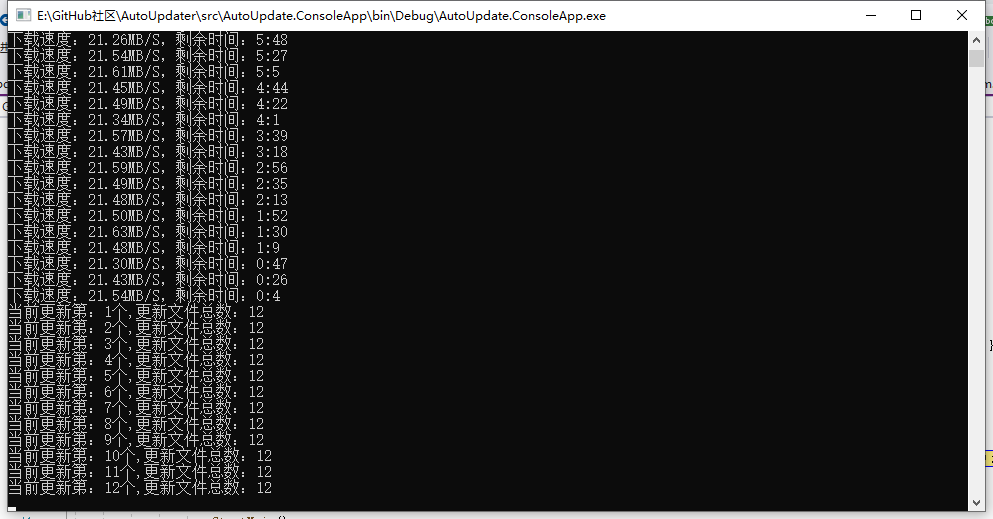

# GeneralUpdate #

[English introduction](https://github.com/WELL-E/AutoUpdater/blob/master/README_en.md)

### 组件介绍 ###

GeneralUpdate是基于.net standard开发的一款（c/s应用）自动升级程序。该组件将更新的核心部分抽离出来方便应用于多种项目当中目前适用于wpf，控制台应用，winfrom。

### 支持框架

理论支撑：https://docs.microsoft.com/zh-cn/dotnet/standard/net-standard

| 框架名称                              | 是否支持         |
| ------------------------------------- | ---------------- |
| .NET Core 2.0                         | 支持             |
| .NET 5 6 7                            | 支持             |
| .NET Framework 4.6.1                  | 支持             |
| Mono 5.4                              | 理论支持，未验证 |
| Xamarin.iOS                           | 理论支持，未验证 |
| Xamarin.Mac                           | 理论支持，未验证 |
| Xamarin.Android                       | 理论支持，未验证 |
| Universal Windows Platform 10.0.16299 | 理论支持，未验证 |
| Unity 2018.1                          | 理论支持，未验证 |

| UI框架名称        | 是否支持                      |
| ----------------- | ----------------------------- |
| WPF               | 支持                          |
| UWP               | 商店模式下不可更新（lindexi） |
| MAUI              | 暂不支持，正在兼容            |
| Avalonia          | 未验证，等待反馈              |
| WinUI             | 未验证，等待反馈              |
| Console（控制台） | 支持                          |

### 操作系统

| 操作系统名称 | 是否支持 |
| ------------ | -------- |
| Windows      | 支持     |
| Linux        | 未验证   |
| Mac          | 未验证   |
| iOS          | 暂不支持 |
| Android      | 暂不支持 |

### 功能介绍 ###

- GeneralUpdate.Core：断点续传、逐版本更新。
- GeneralUpdate.ClientCore：断点续传、逐版本更新、更新组件自更新、便捷启动更新组件
- GeneralUpdate.AspNetCore：服务端支持更新包下载地址、版本信息等内容。
- GeneralUpdate.Zip：解压更新包、解压进度通知。
- GeneralUpdate.Single：应用程序单例运行。
- GeneralUpdate.Common：组件公共类、方法。
- 源码"sql"目录下包含mysql数据库表内容的生成脚本。

### 帮助文档 ###
- 讲解视频： https://www.bilibili.com/video/BV1aX4y137dd
- 官方网站： http://justerzhu.cn/

### 讨论组 ###
GeneralUpdate开源项目讨论QQ群：748744489

.Net技术讨论QQ群：580749909

### 开源地址 ###
- https://github.com/WELL-E/AutoUpdater
- https://gitee.com/Juster-zhu/GeneralUpdate

### Nuget地址 ###

- https://www.nuget.org/packages/GeneralUpdate.Common/
- https://www.nuget.org/packages/GeneralUpdate.ClientCore/
- https://www.nuget.org/packages/GeneralUpdate.AspNetCore/
- https://www.nuget.org/packages/GeneralUpdate.Zip/
- https://www.nuget.org/packages/GeneralUpdate.Single/
- https://www.nuget.org/packages/GeneralUpdate.Core/

### 更新流程图 ###

### 运行效果及更新流程展示 ###

### 快速启动 ###

（1） Example GeneralUpdate.ClientCore

        private ClientParameter clientParameter;
        private GeneralClientBootstrap generalClientBootstrap;
    
        private void Button_Click(object sender, RoutedEventArgs e)
        {
            Task.Run(async()=> 
            {
                //主程序信息
                var mainVersion = "1.1.1";
                var mianType = 1;
    
                //该对象用于主程序客户端与更新组件进程之间交互用的对象
                clientParameter = new ClientParameter();
                //更新组件的版本号
                clientParameter.ClientVersion = "1.1.1";
                //客户端类型：1.主程序客户端 2.更新组件
                clientParameter.ClientType = 2;
                //更新程序exe名称
                clientParameter.AppName = "AutoUpdate.ConsoleApp";
                //主程序客户端exe名称
                clientParameter.MainAppName = "AutoUpdate.Test";
                //本机的客户端程序应用地址
                clientParameter.InstallPath = @"D:\update_test";
                //更新公告网页
                clientParameter.UpdateLogUrl = "https://www.baidu.com/";
                //更新组件请求验证更新的服务端地址
                clientParameter.ValidateUrl = $"https://127.0.0.1:5001/api/update/getUpdateValidate/{ clientParameter.ClientType }/{ clientParameter.ClientVersion }";
                //更新组件更新包下载地址
                clientParameter.UpdateUrl = $"https://127.0.0.1:5001/api/update/getUpdateVersions/{ clientParameter.ClientType }/{ clientParameter.ClientVersion }";
                //主程序客户端请求验证更新的服务端地址
                clientParameter.MainValidateUrl = $"https://127.0.0.1:5001/api/update/getUpdateValidate/{ mianType }/{ mainVersion }";
                //主程序客户端更新包下载地址
                clientParameter.MainUpdateUrl = $"https://127.0.0.1:5001/api/update/getUpdateVersions/{ mianType }/{ mainVersion }";
    
                generalClientBootstrap = new GeneralClientBootstrap();
                //单个或多个更新包下载通知事件
                generalClientBootstrap.MutiDownloadProgressChanged += OnMutiDownloadProgressChanged;
                //单个或多个更新包下载速度、剩余下载事件、当前下载版本信息通知事件
                generalClientBootstrap.MutiDownloadStatistics += OnMutiDownloadStatistics;
                //单个或多个更新包下载完成
                generalClientBootstrap.MutiDownloadCompleted += OnMutiDownloadCompleted;
                //完成所有的下载任务通知
                generalClientBootstrap.MutiAllDownloadCompleted += OnMutiAllDownloadCompleted;
                //下载过程出现的异常通知
                generalClientBootstrap.MutiDownloadError += OnMutiDownloadError;
                //整个更新过程出现的任何问题都会通过这个事件通知
                generalClientBootstrap.Exception += OnException;
                //ClientStrategy该更新策略将完成1.自动升级组件自更新 2.启动更新组件 3.配置好ClientParameter无需再像之前的版本写args数组进程通讯了。
                generalClientBootstrap.Config(clientParameter).
                    Strategy<ClientStrategy>();
                await generalClientBootstrap.LaunchTaskAsync();
            });
        }
    
        private void OnMutiDownloadStatistics(object sender, MutiDownloadStatisticsEventArgs e)
        {
             //e.Remaining 剩余下载时间
             //e.Speed 下载速度
             //e.Version 当前下载的版本信息
        }
    
        private void OnMutiDownloadProgressChanged(object sender, MutiDownloadProgressChangedEventArgs e)
        {
            //e.TotalBytesToReceive 当前更新包需要下载的总大小
            //e.ProgressValue 当前进度值
            //e.ProgressPercentage 当前进度的百分比
            //e.Version 当前下载的版本信息
            //e.Type 当前正在执行的操作  1.ProgressType.Check 检查版本信息中 2.ProgressType.Donwload 正在下载当前版本 3. ProgressType.Updatefile 更新当前版本 4. ProgressType.Done更新完成 5.ProgressType.Fail 更新失败
            //e.BytesReceived 已下载大小
        }

（2） Example GeneralUpdate.Core

    static void Main(string[] args)
    {
        var resultBase64 = args[0];
        var bootstrap = new GeneralUpdateBootstrap();
        bootstrap.Exception += OnException;
        bootstrap.MutiDownloadError += OnMutiDownloadError;
        bootstrap.MutiDownloadCompleted += OnMutiDownloadCompleted;
        bootstrap.MutiDownloadStatistics += OnMutiDownloadStatistics;
        bootstrap.MutiDownloadProgressChanged += OnMutiDownloadProgressChanged;
        bootstrap.MutiAllDownloadCompleted += OnMutiAllDownloadCompleted;
        bootstrap.Strategy<DefaultStrategy>().
            Option(UpdateOption.DownloadTimeOut, 60).
            RemoteAddressBase64(resultBase64).
            LaunchAsync();
    }

（3） Example GeneralUpdate.AspNetCore

    Startup.cs
    public void ConfigureServices(IServiceCollection services)
    {
        services.AddControllers();
        services.AddSingleton<IUpdateService, GeneralUpdateService>();
    }
    
    UpdateController.cs
    
    private readonly ILogger<UpdateController> _logger;
    private readonly IUpdateService _updateService;
    
    public UpdateController(ILogger<UpdateController> logger, IUpdateService updateService)
    {
        _logger = logger;
        _updateService = updateService;
    }
    
    /// 

    /// https://localhost:5001/api/update/getUpdateVersions/1/1.1.1
    /// 

    /// <param name="clientType"> 1:ClientApp 2:UpdateApp</param>
    /// <param name="clientVersion"></param>
    /// <returns></returns>
    [HttpGet("getUpdateVersions/{clientType}/{clientVersion}")]
    public async Task<IActionResult> GetUpdateVersions(int clientType, string clientVersion)
    {
        _logger.LogInformation("Client request 'GetUpdateVersions'.");
        var resultJson = await _updateService.UpdateVersionsTaskAsync(clientType, clientVersion, UpdateVersions);
        return Ok(resultJson);
    }
    
    /// 

    /// https://localhost:5001/api/update/getUpdateValidate/1/1.1.1
    /// 

    /// <param name="clientType"> 1:ClientApp 2:UpdateApp</param>
    /// <param name="clientVersion"></param>
    /// <returns></returns>
    [HttpGet("getUpdateValidate/{clientType}/{clientVersion}")]
    public async Task<IActionResult> GetUpdateValidate(int clientType, string clientVersion)
    {
        _logger.LogInformation("Client request 'GetUpdateValidate'.");
        var lastVersion = GetLastVersion();
        var resultJson = await _updateService.UpdateValidateTaskAsync(clientType, clientVersion, lastVersion, true, GetValidateInfos);
        return Ok(resultJson);
    }

## 支持作者 ###

作者：Juster.zhu & Charles.Yu

